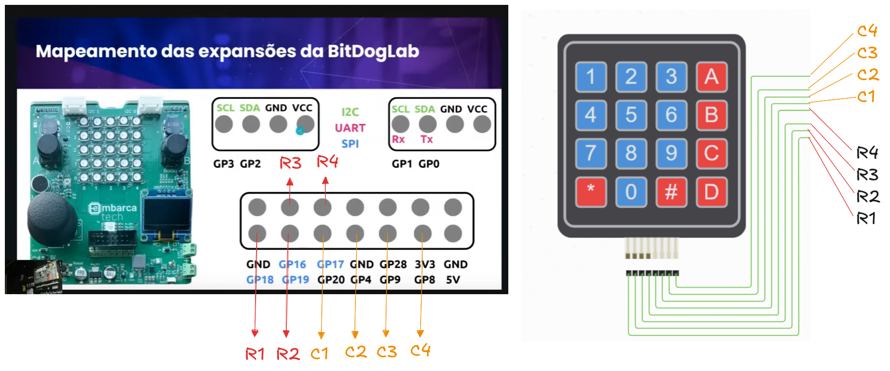

# Leitura de Teclado Matricial (Matrix Keypad)

A seguir desenvolvemos, passo a passo,  as etapas de síntese de um programa - em linguagem C - para ler um teclado matricial 4x4 utilizando a BitDogLab. O exemplo explora como capturar entradas mais complexas utilizando os pinos GPIO de expansão do BitDogLab.

## Atividade:

Vamos desenvolver um programa, em C, para ler os caracteres pressionados em um teclado matricial 4x4. Após a leitura, vamos exibi-lo via comunicação serial.

## Entendendo o Problema:

Este exemplo demonstra a implementação de um teclado matricial 4x4 utilizando a BitDogLab, onde apenas oito pinos GPIO são necessários para detectar 16 teclas diferentes. Através de uma técnica de varredura (scanning) que monitora linhas e colunas da matriz, o sistema identifica e mapeia cada tecla pressionada para seu caractere específico. Esta aplicação prática serve como base para o desenvolvimento de interfaces de entrada mais elaboradas, permitindo criar sistemas interativos que necessitam de entrada de dados via teclado matricial.

## Materiais Necessários

Para execução deste exemplo, serão necessários além do BitDogLab:

- 1x teclado matricial 4x4 (16 teclas)


- 8x fios jumpers Macho-Fêmea


## Desenvolvimento:

### Montagem do Circuito

O teclado matricial possui 8 pinos: 4 correspondentes às colunas e 4 às linhas. Esses pinos serão conectados aos GPIOs do BitDogLab para realizar a varredura e identificar quais teclas estão sendo pressionadas.

1. Conexão das Linhas do Teclado:
- Conecte os pinos das linhas (R1, R2, R3 e R4) aos pinos GPIO 18, 19, 16 e 17, respectivamente.

2. Conexão das Colunas do Teclado:
- Conecte os pinos das colunas (C1, C2, C3 e C4) aos pinos GPIO 20, 4, 9, 8, respectivamente.



## Funcionamento do código

Neste exemplo, o Raspberry Pi Pico realiza uma varredura das linhas e colunasdo teclado matricial para identificar qual tecla está sendo pressionada.A técnica de varredura funciona ativando uma linha por vez e verificandoquais colunas estão em nível alto. Cada tecla do teclado matricial estáposicionada na interseção de uma linha e uma coluna, permitindo identificarprecisamente qual tecla foi pressionada. O uso do mapa de teclas (`key_map` - vide código abaixo) permite traduzir a posição de cada tecla no teclado para o caracterecorrespondente. Quando uma tecla é detectada, seu caractere é exibido noterminal, facilitando o desenvolvimento de interfaces interativas e sistemasde controle mais complexos.

### Inclusão das bibliotecas:

- `#include "pico/stdlib.h"`: Inclui a biblioteca padrão do Raspberry Pi Pico, que contém as funções necessárias para configurar e controlar os GPIOs e para realizar operações de entrada e saída.

### Definição dos Pinos e do Mapa de Teclas (configurando entradas):

- `const uint row_pins[ROWS]` e `col_pins[COLS]`: Define os pinos utilizados para as linhas e colunas do teclado matricial

- `const char key_map[ROWS][COLS]`: Mapa de teclas que associa cada combinação de linha e coluna a um caractere específico.

### Função keypad_init():

Inicializa os pinos das linhas como saídas e os das colunas como entradas, configurando as colunas com resistores de pull-down para garantir que o estado padrão seja zero.

### Função read_keypad():

Realiza a varredura do teclado ativando cada linha uma de cada vez e verificando se alguma coluna está em nível alto. Se uma tecla for pressionada, retorna o caractere correspondente do mapa de teclas.

### Loop principal:

Lê continuamente o estado do teclado. Se uma tecla for pressionada, imprime o caractere correspondente na saída padrão (terminal) e aguarda 200 milissegundos para evitar múltiplas leituras consecutivas da mesma tecla.

## Pseudocódigo - Linguagem C


## Código completo em C

```c
/**
 * Embarcatech 
 * Exemplo Teclado Matricial
 */

#include <stdio.h>
#include "pico/stdlib.h"

#define ROWS 4
#define COLS 4

const uint row_pins[ROWS] = {18, 19, 16, 17}; // Pinos conectados nas linhas R1, R2, R3, R4
const uint col_pins[COLS] = {20, 4, 9, 8}; // Pinos conectados nas linhas C1, C2, C3, C4

const char key_map[ROWS][COLS] = {
    {'1', '2', '3', 'A'},
    {'4', '5', '6', 'B'},
    {'7', '8', '9', 'C'},
    {'*', '0', '#', 'D'}
};

void keypad_init() {
    for (int i = 0; i < ROWS; i++) {
        gpio_init(row_pins[i]);
        gpio_set_dir(row_pins[i], GPIO_OUT);
        gpio_put(row_pins[i], 0); // configura as linhas como saídas em nível baixo
    }

    for (int i = 0; i < COLS; i++) {
        gpio_init(col_pins[i]);
        gpio_set_dir(col_pins[i], GPIO_IN);
        gpio_pull_down(col_pins[i]); // configura as colunas como entradas com pull-down
    }
}

char read_keypad() {
    for (int row = 0; row < ROWS; row++) {
        gpio_put(row_pins[row], 1); // Ativa a linha atual
        for (int col = 0; col < COLS; col++) {
            if (gpio_get(col_pins[col])) { // Verifica se a coluna atual está em nível alto
                gpio_put(row_pins[row], 0); // Desativa a linha atual
                return key_map[row][col]; // Retorna o caractere correspondente
            }
        }
        gpio_put(row_pins[row], 0); // configura a linha como saída em nível baixo
    }
    return '\0'; // Retorna nulo se nenhuma tecla foi pressionada
}

int main()
{
    stdio_init_all();
    keypad_init(); // Inicializa o teclado matricial

    while (true) {
        char key = read_keypad(); // Lê a tecla pressionada
        if (key != '\0') { // Verifica se alguma tecla foi pressionada
            printf("Tecla pressionada: %c\n", key); // Exibe a tecla pressionada
            sleep_ms(350); // Aguarda 350 ms para evitar múltiplas leituras
        }
    }
    return 0;
}
```

## Arquivo CMake

Lembre-se que antes de validar nosso algoritmo precisamos fazer algumas definições de compilação usando o CMake.

O arquivo CMakeLists.txt é essencial para configurar como o programa será compilado e vinculado às bibliotecas necessárias. Ele atua como uma "receita" para o CMake criar o arquivo binário final que será carregado na Raspberry Pi Pico.

Considere que o nome do projeto é `matrix_keypad`.

## CMakeLists.txt

```ruby
# Define a versão mínima do CMake necessária para o projeto
cmake_minimum_required(VERSION 3.13)

set(CMAKE_C_STANDARD 11)
set(CMAKE_CXX_STANDARD 17)
set(CMAKE_EXPORT_COMPILE_COMMANDS ON)

# Initialise pico_sdk from installed location
# (note this can come from environment, CMake cache etc)

# == DO NOT EDIT THE FOLLOWING LINES for the Raspberry Pi Pico VS Code Extension to work ==
if(WIN32)
    set(USERHOME $ENV{USERPROFILE})
else()
    set(USERHOME $ENV{HOME})
endif()
set(sdkVersion 2.1.0)
set(toolchainVersion 13_3_Rel1)
set(picotoolVersion 2.1.0)
set(picoVscode ${USERHOME}/.pico-sdk/cmake/pico-vscode.cmake)
if (EXISTS ${picoVscode})
    include(${picoVscode})
endif()
# ====================================================================================
set(PICO_BOARD pico_w CACHE STRING "Board type")

# Pull in Raspberry Pi Pico SDK (must be before project)
include(pico_sdk_import.cmake)

project(matrix_keypad C CXX ASM)

# Initialise the Raspberry Pi Pico SDK
pico_sdk_init()

# Add executable. Default name is the project name, version 0.1

add_executable(matrix_keypad matrix_keypad.c )

pico_set_program_name(matrix_keypad "matrix_keypad")
pico_set_program_version(matrix_keypad "0.1")

# Modify the below lines to enable/disable output over UART/USB
pico_enable_stdio_uart(matrix_keypad 0)
pico_enable_stdio_usb(matrix_keypad 1)

# Add the standard library to the build
target_link_libraries(matrix_keypad
        pico_stdlib)

# Add the standard include files to the build
target_include_directories(matrix_keypad PRIVATE
        ${CMAKE_CURRENT_LIST_DIR}
)

# Add any user requested libraries
target_link_libraries(matrix_keypad 
        
        )

pico_add_extra_outputs(matrix_keypad)
```

Explicação adicional ao arquivo CMakeLists.txt:

- pico_enable_stdio_usb(matrix_keypad 1): Habilita a saída de depuração via USB. Os caracteres pressionados no teclado matricial durante a execução do programa são exibidos no Monitor Serial, baud rate 115200.

## Exercício:

 Estruturar um hipotético sistema de segurança, no qual o teclado matricial será utilizado para a entrada de uma senha de quatro dígitos e os LEDs para indicar o status do cofre (verde - liberado; vermelho - fechado).